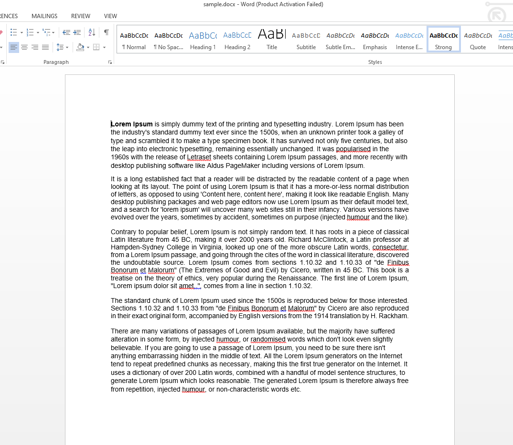
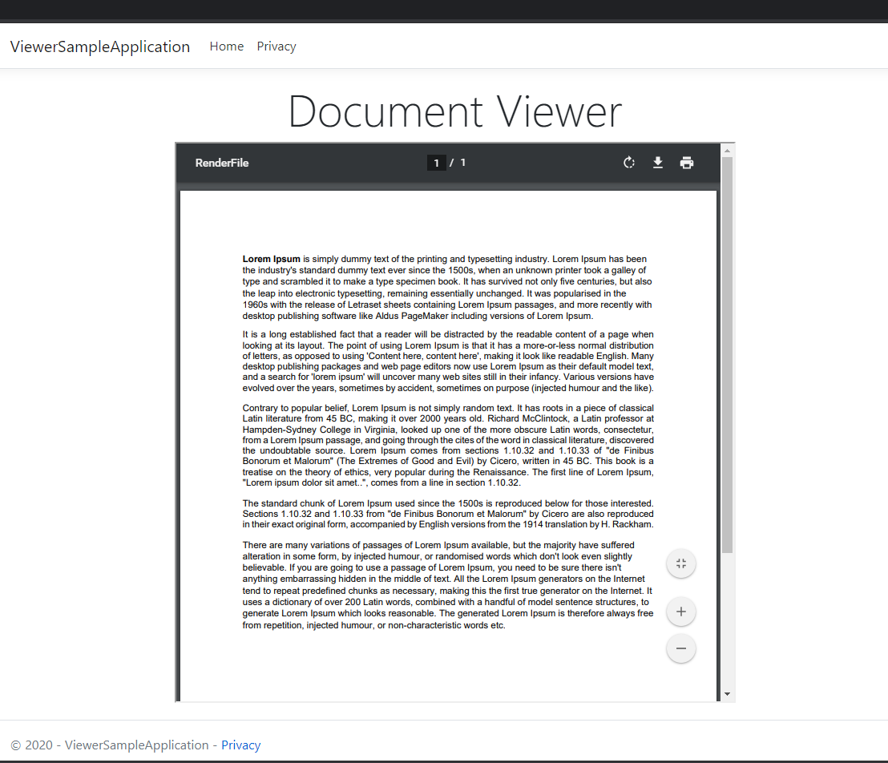

# Render a Document in Razor View
This .NET Core web application will elaborate how GroupDocs.Viewer for .NET [API](https://products.groupdocs.com/viewer/net) renders a document in browser. It takes a source file as input, and renders it in Razor View. 

### How to Run
* Download or clone the project
* Add GroupDocs.Viewer for .NET DLL/Install NuGet
* Build and run solution

### Loading Document From Azure
If you want to pull the source file from Azure Blog Storage, you have to provide container name, endpoint, account key and name.  

If you don't have a license. You can request a [temporary license](https://purchase.groupdocs.com/buy) in order to evaluate these proejcts without any API limitation. 

## Screenshots
* Sample Word document in MS Word
 
* Displayed using ASP.NET Core application

# Interested in GroupDocs free consulting project?
[If you are also interested in a free consulting project by GroupDocs team then please view details on this page](https://github.com/groupdocs-free-consulting/)

If you have any questions about GroupDocs APIs, please feel free to post your query in [GroupDocs Forum](https://forum.groupdocs.com/).

Also, you can keep in touch with the latest developments in file format APIs offered by GroupDocs at our [Blog](https://blog.groupdocs.com/).

# This free consulting project is based on the following issues:
* [DotNet Core 3.1 App that includes downloading files from Azure Storage to be viewed within the application](https://github.com/groupdocs-free-consulting/projects/issues/6) 

